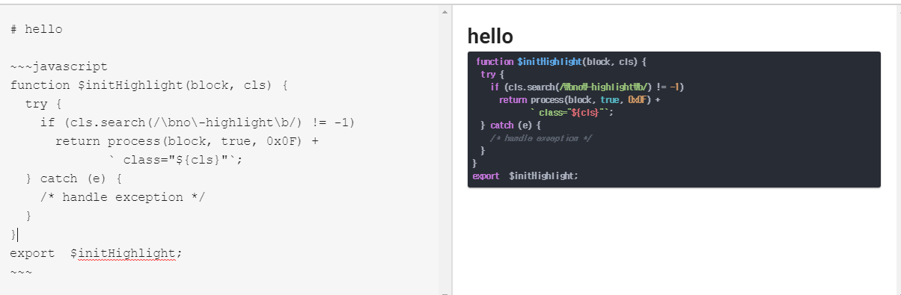

# Nuxt에 Marked와 highlight.js 적용

**Package install**

    npm install --save marked

    npm install --save highlight.js

**In Vue**

      <template lang="html">
        

          <textarea v-model="input"></textarea>
        

        

          

        

      </template>

      

**In nuxt.config.js**

      // styles 아래에 많은 style이 있으니 다른걸로 변경 가능
      css: [
      { src: '~/node_modules/highlight.js/styles/atom-one-dark.css', lang: 'css' }
      ],

**In Web Page**

      //사용자 입력을 받는 front-end단 에서는 ~~~ 안에 코드를 입력해야 적용된다.
      ~~~ javascript
      function $initHighlight(block, cls) {
        try {
          if (cls.search(/\bno\-highlight\b/) != -1)
            return process(block, true, 0x0F) +
                   ` class="${cls}"`;
        } catch (e) {
          /* handle exception */
        }
      }
      export  $initHighlight;
      ~~~

